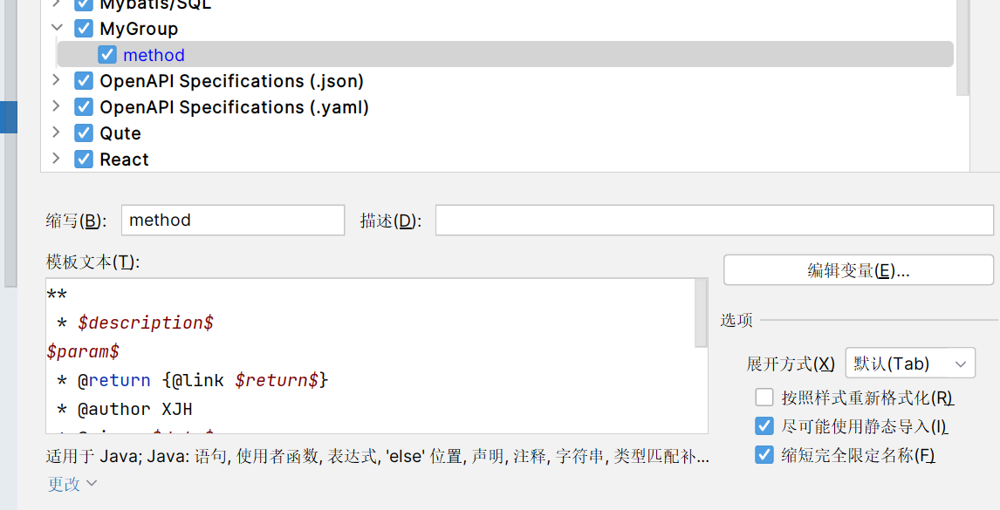
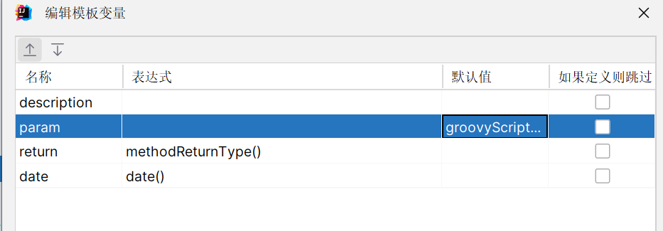

# 类注释&方法注释模板
# 类注释
```java
/**
 * <p>
 * $description$
 * </p>
 *
 * @author author
 * @version 1.0
 * @since ${DATE}
 */
```
# 方法注释模板
```java
**
 * $description$
$param$
 * @return {@link $return$}
 * @author author
 * @since $date$
 **/
```




param函数：

```groovy
groovyScript(
    "def result = '';
     def params = \"${_1}\".replaceAll('[\\\\[|\\\\]|\\\\s]', '').split(',').toList();
     def paramType = \"${_2}\".replaceAll('[\\\\[|\\\\]|\\\\s]', '').split(',').toList();
     for(i = 0; i < params.size(); i++) {
        if(params[i] != '')
            result+=' * @param ' + params[i] + ' ' + '{@link ' + paramType[i] + '} ' + ((i < params.size() - 1) ? '\\r\\n    ' : '')
     }; 
    return result == '' ? null : result"
    ,methodParameters(), methodParameterTypes()
) 
```